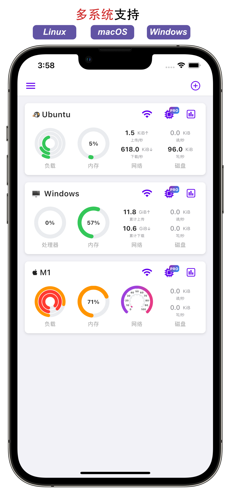
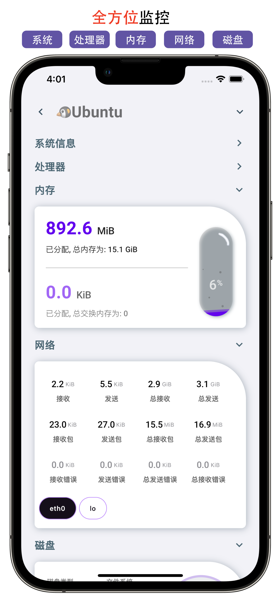
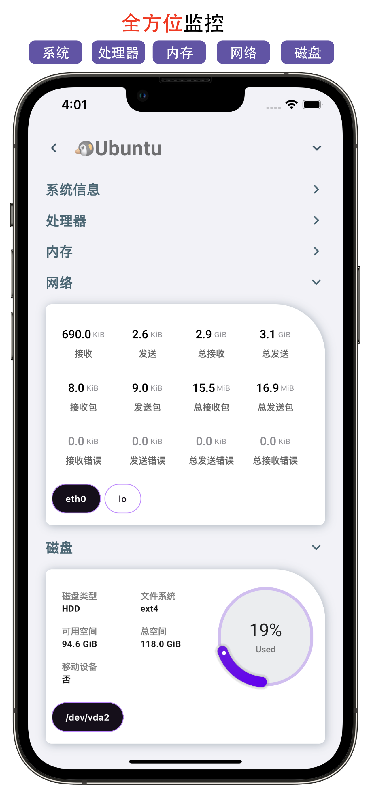
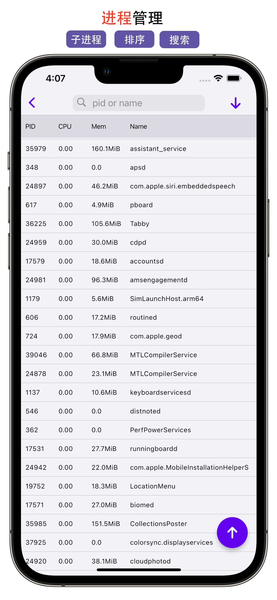
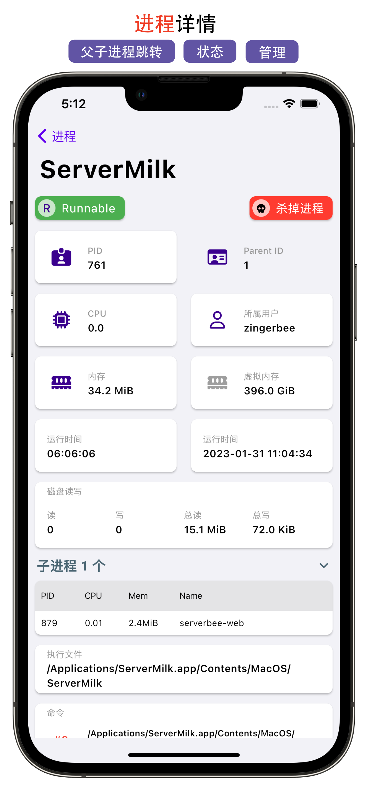
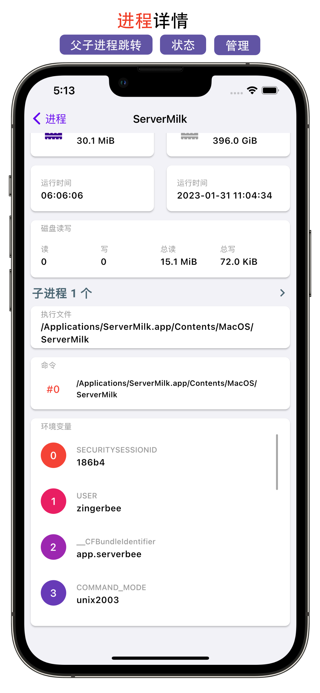
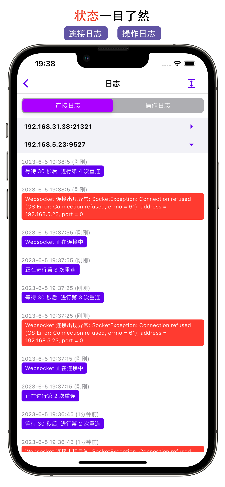
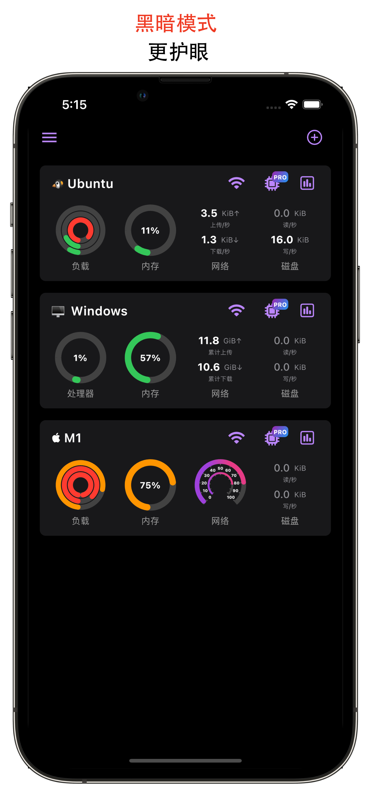

Wow!

### Languages I use

  
  
  
  
  
  
  

### Frames

  
  
  
  
  
  
  

### Tools

  
  
  
  

### Stats

  
  

### App I build

<a href="https://apps.apple.com/us/app/serverbee/id6443553714" target="_blank">

一款支持跨平台集监控、管理和终端的效率工具，支持 Linux 、Windows 、macOS ，甚至是 Nas 系统。

A productivity tool that supports cross-platform monitoring, management, and terminals, supporting Linux, Windows, macOS, and even Nas systems.

- Official Website: https://serverbee.app
- Documentation: [https://docs.serverbee.app](https://docs.serverbee.app)

## Snapshot
|  |  |  |
| :----:| :----: | :----: |
|  |  |  |
|  |  |  |
|  |  |  |
